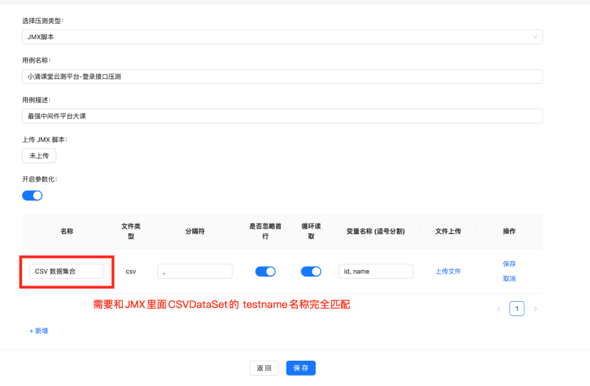

#  ---功能分析---
业务开发里面参数一般不是固定方式，单参数可能走缓存则影响性能，所以会采用可变参数进行压测
比如压测商品详情，查看id从1~100 的商品详情

# Jmeter原生 CSV可变参数配置实战

线程组—>添加—>配置原件—>CSV Data Set Config

# 需求 ---实现可变参数的压测
* 查看原生的JMX里面带可变参数的组成结构，梳理如果是平台化应该如何设计和交互
* 带CSV文件的JMX脚本结构介绍

Q1 可变参数压测-架构链路设计**难点三问**

Q1.1 - CSV参数不是固定的，包括有**多个文件、多个参数**等，这个**数据库表**应该如何设计？
===>测试用例的 `relation` 字段，存储JSON数组
**每个JSON对象就是一个可变参数对象，通过name名称匹配具体哪个可变参数**

Q1.2 - JMX脚本里面的文件路径是写死本地的，云测平台压测执行的时候，**CSV参数文件如何和JMX脚本关联起来？**
===> 通过分布式文件存储相关的可变参数，文件名称需要和JMX里面可变参数名称匹配(需要和jmx文件中的CSVDataSet中的testname名称完全匹配)

Q1.3 -  测试完成后，如何清理相关临时参数文件数据？
测试完成后，通过临时的JMX脚本找到可变参数的文件路径，执行删除

# 可变参数需求 开发
上传用例的时候封装可变参数对象,映射到relation字段
压测的时候 ：组装测试计划

