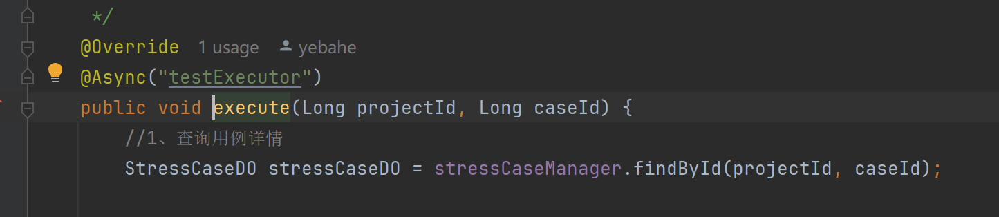
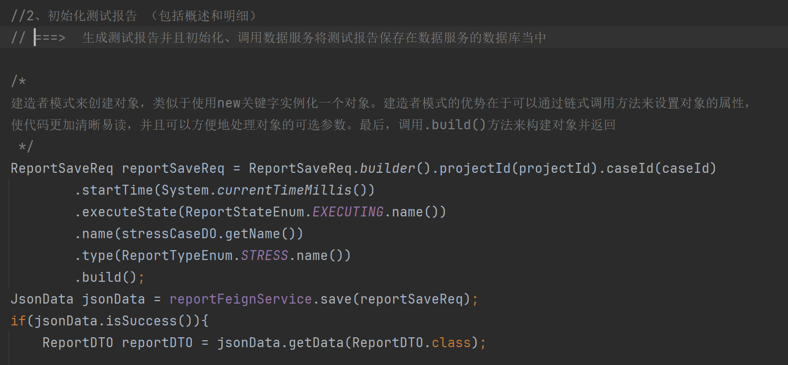
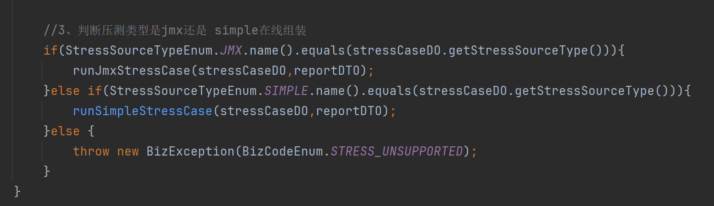
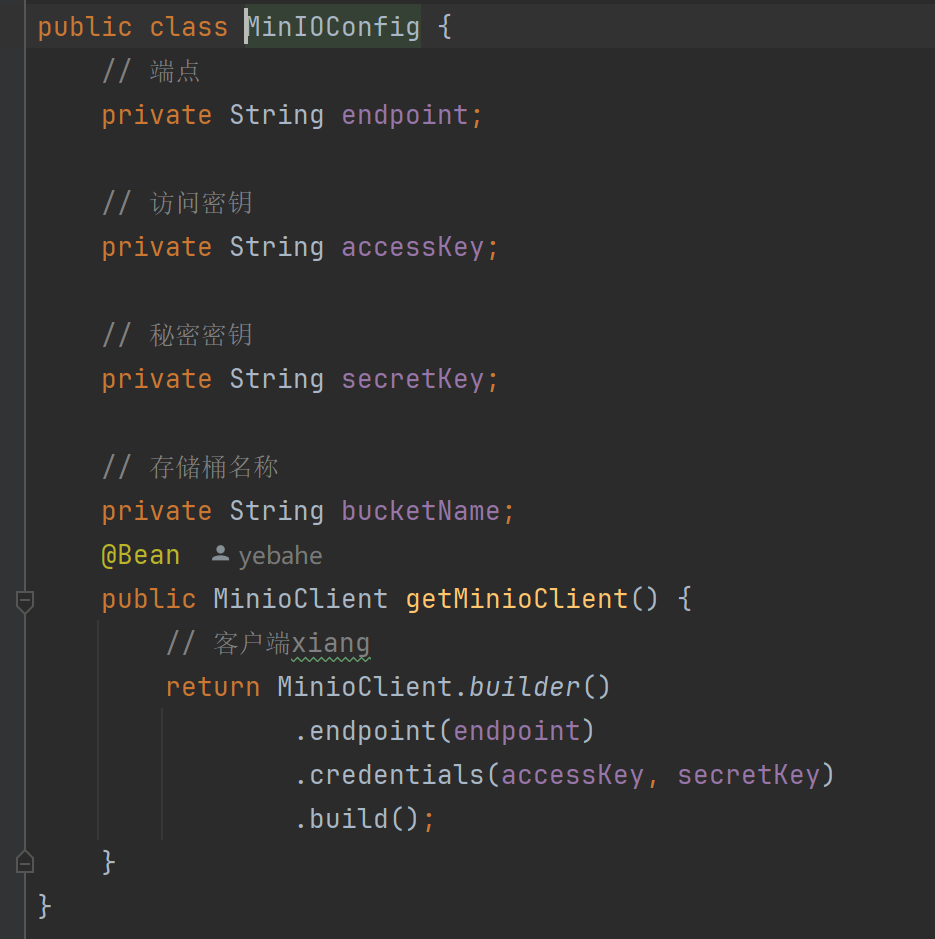
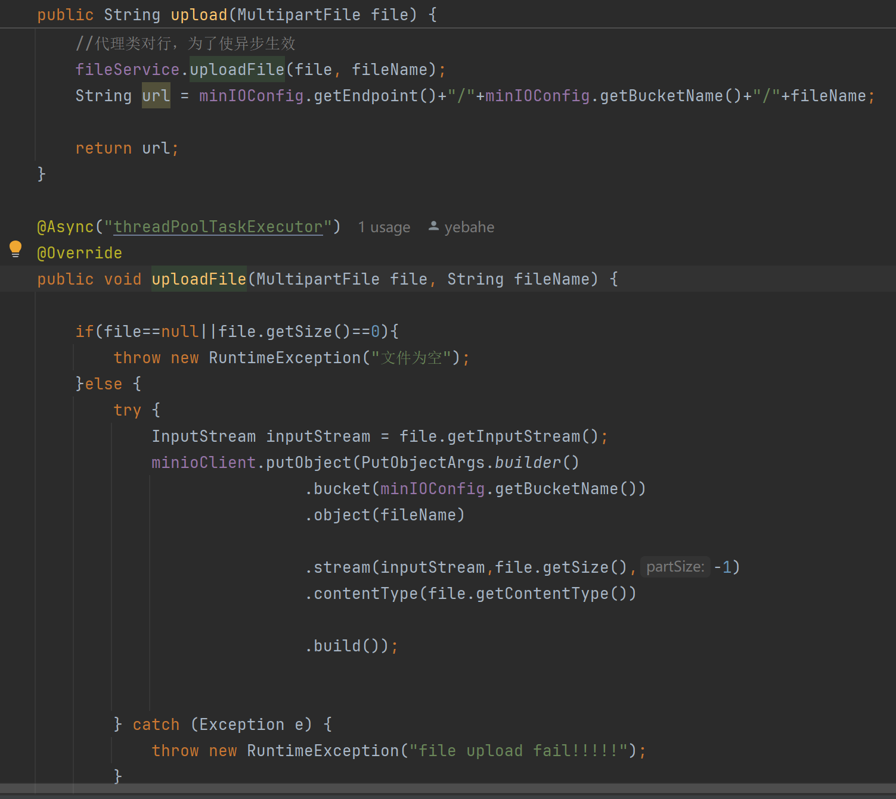
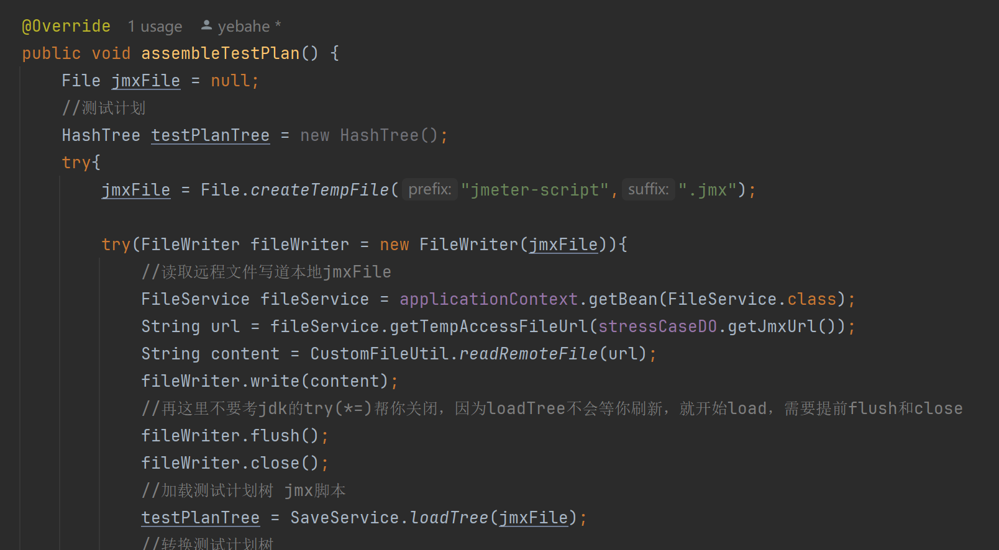
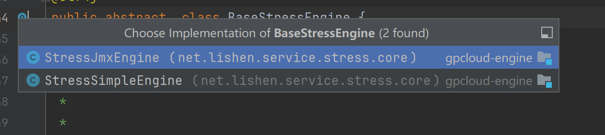

一、需求 ：开发执行测试用例的接口StressCaseController.execute()
1） 执行压测用例链路分析
1、查询用例详情
2、初始化测试报告
3、判断压测类型
4、初始化测试引擎、组装测试计划
5、执行压测
6、发送压测结果
7、清理数据
8、通知压测结果
===> 传入pid 和scid 、从数据库中读取压测用例的详情 ===> 初始化压测报告：远程调用数据服务保存压测报告到数据库中
===> 判断压测类型 ===> 创建不同的压测引擎（实际上是jmter已经创建好的） ===> 执行测压方法（

开发 1、查询用例详情
 

开发 2、初始化测试报告
2） 创建数据服务：提供初始化测试报告的方法 
需求分解 ：
2.1 ） 用例执行前需要初始化压测报告===> 即生成一个测试报告并且初始化，然后调用数据服务来将测试报告保存 
2.2） rpc调用 压测服务远程调用数据服务
初始化测试报告 

开发 3、判断压测类型 （

Q3.1 现在执行JMX类型的用例，那JMX脚本从哪里获取？
===>需要上传JMX脚本到服务器（选用MinIO分布式文件存储系统）===>Docker容器化部署分布式文件存储MinIO
===>封装线程池异步上传JMX脚本（FileController）
Q3.2 上传步骤 ：fileController.update => fileService.upload => 异步上传

实际执行：

Q3.3文件上传后不能公开读写吧，那怎么访问呢？ ===>getTempAccessFileUrl

Q3.4获取压测脚本的步骤是怎么样的 ？

在StressCaseService中判断压测脚本类型、执行对应的方法
runJmxStressCase(stressCaseDO,reportDTO); ==> baseStressEngine.startStressTest();
==> 模板方法设计模式 ：StressJmxEngine.assembleTestPlan 根据jml脚本组装测试计划

开发4、自定义压测结果收集器
需求分析 ：之前执行的结果是.csv文件，存在本地，压测结果需要发送到消息队列当中，从另外一端进行消费
自定义结果收集器 -  继承 重写 子实现
需求分解 ：构建Map存储不同的结果收集器，注入消息组件（聚合），每次触发的时候将结果收集发送到消息组件
1-自定义压测结果收集器，继承ResultCollector，重写里面的方法  `public void sampleOccurred(SampleEvent event)` 

开发5、测试引擎执行类（）-模版方法骨架类开发 BaseStressEngine

