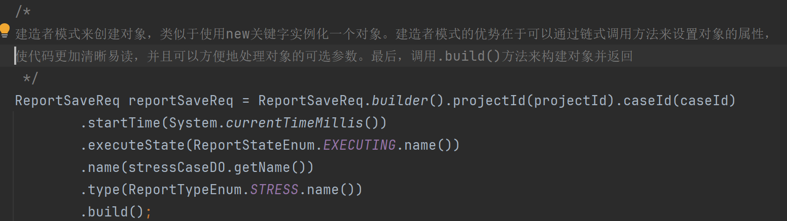

一、需求 ：开发执行测试用例的接口
1） 执行压测用例链路分析
1、查询用例详情
2、初始化测试报告
3、判断压测类型
4、初始化测试引擎、组装测试计划
5、执行压测
6、发送压测结果
7、清理数据
8、通知压测结果
开发 1、查询用例详情
 

开发 2、初始化测试报告
2） 创建数据服务 -初始化测试报告
需求分解 ：
2.1 ） 用例执行前需要初始化压测报告、
2.2） rpc调用 压测服务远程调用数据服务
初始化测试报告 

开发 3、判断压测类型

现在执行JMX类型的用例，那JMX脚本从哪里获取？

解决方法 ：===> 分布式文件存储、
为什么需要文件存储？本地的jmx文件需要上传到服务器中，执行脚本的时候从服务器中获取
传统的javaweb项目，文件数量到达一定量的时候会占据大量的内存、磁盘、无法满足海量的请求的业务
分布式文件系统 ：
选用 ： Minlo
开发3.1 、文件上传  ：封装线程池 异步上传文件

压测结果收集器分析 ：

开发4、自定义压测结果收集器
需求分析 ：之前执行的结果是.csv文件，存在本地，压测结果需要发送到消息队列当中，从另外一端进行消费
自定义结果收集器 -  继承 重写 子实现
需求分解 ：构建Map存储不同的结果收集器，注入消息组件（聚合），每次触发的时候将结果收集发送到消息组件
1-自定义压测结果收集器，继承ResultCollector，重写里面的方法  `public void sampleOccurred(SampleEvent event)` 

开发5、测试引擎执行类-模版方法骨架类开发

