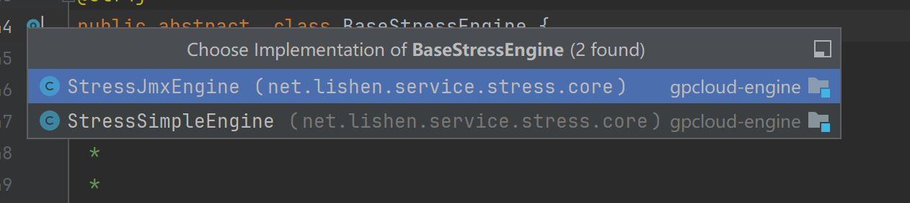

开发4、自定义压测结果收集器
需求分析 ：之前执行的结果是.csv文件，存在本地，压测结果需要发送到消息队列当中，从另外一端进行消费
自定义结果收集器 -  继承 重写 子实现
需求分解 ：构建Map存储不同的结果收集器，注入消息组件（聚合），每次触发的时候将结果收集发送到消息组件
1-自定义压测结果收集器，继承ResultCollector，重写里面的方法  `public void sampleOccurred(SampleEvent event)`

开发5、测试引擎执行类（）-模版方法骨架类开发 BaseStressEngine

